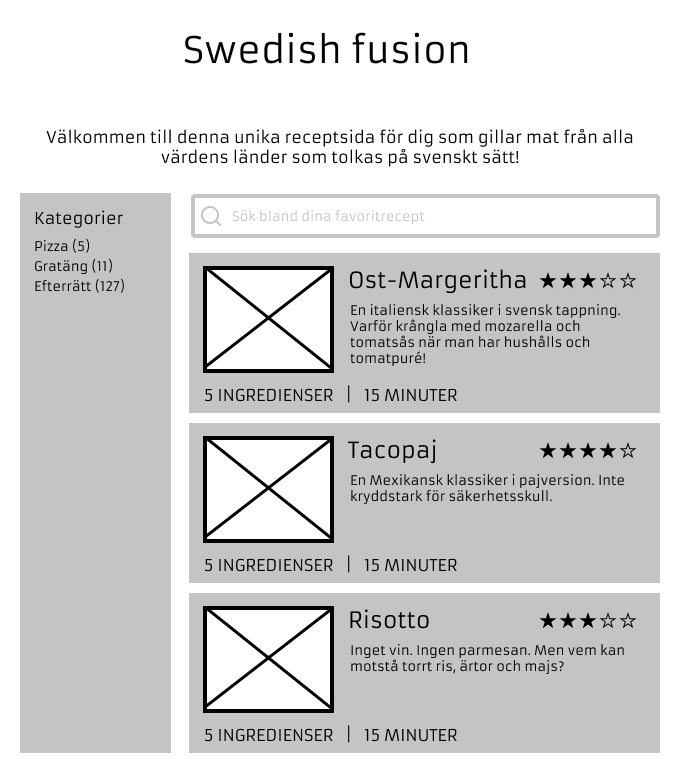
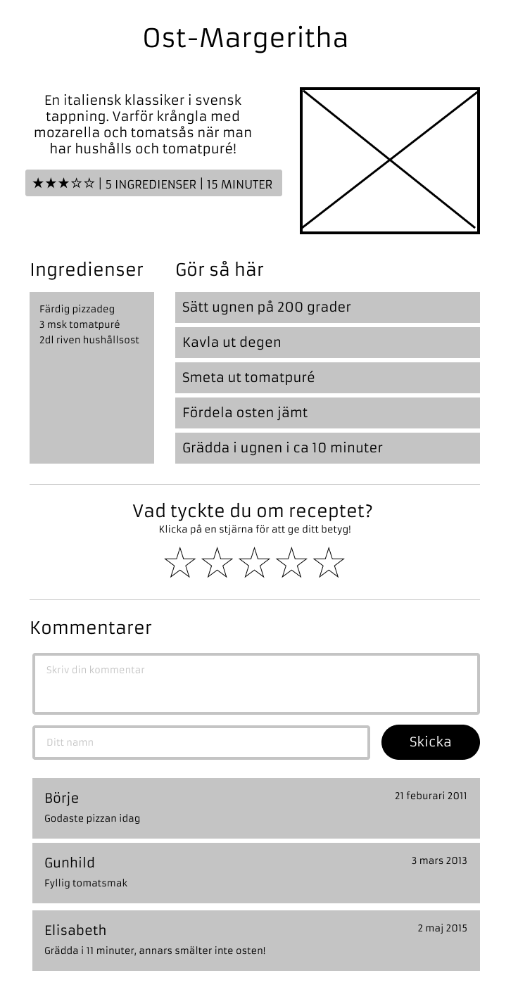

# Slutprojekt - Receptsajten

Din uppgift är att bygga en fullstacklösning för en receptsajt. Du får fritt välja tema för din sajt. Kanske är någon av *Finska desserter*, *Alkoholfria gindrinkar* eller *Souz vide-klassiker* exempel på en receptsida du alltid saknat? Eller något helt annat!

En snygg design är såklart roligt att göra, även om det inte är huvudfokus för denna uppgift och något som tas med i bedömningen.

Uppgiften är uppdelad i två delar: **backend** och **frontend**. Del 1 handlar om att bygga ett Rest-API med *NodeJS*, *Express* och *MongoDB* och del 2 en React-app som konsumerar API:et. Självklart ska alla delar byggas med *TypeScript* och hela projektet ska deployas till *Heroku* och *MongoDB Atlas*!

Projektet ska lämnas in tisdag 24/5 kl 23.59 och presenteras för klassen onsdag 25/5.

---

## Specifikation

### Frontend
**För godkänt**

Appen ska ha ett antal routes. Dessa ska implementeras med hjälp av React Router och är följande:

|Vy             |Frontend- route         |Innehåll |
|---------------|------------------------|---------|
|Startsida      |`/`                     |Här listas alla recept. Man kan söka och filtrera på kategori. |
|Kategorisida   |`/category/:categoryId` |Samma som *startsida* men listar endast recept i en viss kategori |
|Receptsida     |`/recipe/:recipeId`     |Här visas varje recept med ingredienser och instruktioner. |

**Startsida**

- Startsidan ska innehålla en lista med alla recept som ligger i databasen
- Varje recept som listas på startsidan ska visa upp relevant information om receptet, t.ex:
  - Namnet på receptet
  - Liten bild
  - Rating
  - Hur många ingredienser
  - Tid det tar att göra receptet
- Startsidan ska ha en lista som visar alla kategorier
  - Bredvid kategorinamnet ska det stå hur många recept som finns i den kategorin
  - Klickar man på kategorin ska man länkas till *Kategorisidan*
- Startsidan ska ha en sökruta
  - Om man skriver i sökrutan visas endast de recept som matchar sökningen

*Wireframe: Startsida*



**Kategorisida**

- Kategorisidan har samma design som startsidan men listar bara recept i vald kategori
- I kategorilistan ska vald kategori vara markerad med t.ex. fet text

**Receptsida**

- Receptsidan ska minst visa upp:
  - Receptets namn
  - Beskrivning av rätten
  - Rating
  - Antal ingredienser
  - Hur lång tid det tar att laga receptet
  - Bild på maträtten
- Receptsidan ska ha en lista över alla ingredienser
- Receptsidan ska ha en sektion som visar alla instruktioner (Gör så här)
- Receptsidan ska ha en komponent där besökaren kan rösta på receptet genom att klicka på en av fem stjärnor
  - När man klickar på en stjärna skickas rösten in direkt
  - Efter att rösten skickats in ska det stå "Tack för ditt betyg!" istället för stjärnorna

*Kommenteringsfunktion (VG)*

- Användaren ska kunna posta en kommentar genom att
  - Fylla i en kommentar
  - Fylla i sitt namn
  - Klicka på skicka
- Om inte alla fält fyllts i ska tydliga valideringsmeddelanden visas upp för användaren och ingenting skickas iväg
- Under tiden kommentaren skickas ska fälten vara disablade så att man inte kan skicka dubbelt av misstag
- När kommetaren har skickats ska formuläret ersättas med texten "Tack för din kommentar!"
- Kommentarer som andra postat sedan tidigare ska visas upp i en lista och för varje kommentar ska visas
  - Namn på den som kommenterat
  - Kommentaren
  - Datum när kommentaren skickades in

---

*Wireframe: Receptsida*


---
För **väl godkänt**

- Använder Redux för state-hantering
- Implementera en funktion där man på receptsidan kan kommentera enskilda recept
- Ha en välstrukturerad kod, meningsfull namnsättning samt en tydlig mappstruktur och uppdelning mellan olika filer

### Backend

För **godkänt**

- Alla recept ska lagras i en collection i MongoDB
- Det finns ingen funktion för att lägga till recept - receptdata måste läggas till via t.ex. mongo shell eller Compass
- Ett recept-objekt ska innehålla följande egenskaper. Du får lägga till fler om du behöver, men får inte ta bort några:

| Egenskap   | Datatyp         | Värde |
|:-----------|:-----------------|:------|
|id          |string            |Id för receptet |
|title       |string            |Namn på receptet |
|description |string            |Beskrivning av receptet |
|imageUrl    |string            |Länk till bild för receptet (kan ligga online) |
|timeInMins  |string            |Antal minuter det tar att laga receptet |
|ratings     |`array<int>`        |Betyg på receptet (1-5) |
|ingrediensts|`array<Ingredient>` |Ingredienser i receptet |
|instructions|`array<Instruction>`|Instruktioner till receptet |
|comments    |`array<Comment>`    |Kommentarer till receptet |

- Ett ingrediens-objekt ska innehålla följande egenskaper. Du får lägga till fler om du behöver, men får inte ta bort några:

| Egenskap   | Datatyp         | Värde |
|:-----------|:----------------|:------|
|ingredient  |string           |Namn på ingrediensen |
|amount      |number           |Mängd |
|unit        |string           |Enhet som mängden anges i, t.ex. msk, tsk, gram.. |

- Ett instruction-objekt ska innehålla följande egenskaper. Du får lägga till fler om du behöver, men får inte ta bort några:

| Egenskap   | Datatyp         | Värde |
|:-----------|:----------------|:------|
|instruction |string           |Beskrivning av vad man ska göra |
|prio        |int              |Var i ordningen instruktionen kommer |

- Ett comment-objekt (VG) ska innehålla följande egenskaper. Du får lägga till fler om du behöver, men får inte ta bort några:

| Egenskap   | Datatyp         | Värde |
|:-----------|:----------------|:------|
|comment     |string           |Kommentaren som någon skrivit |
|name        |string           |Namn på den som skrivit kommentaren |
|createdAt   |date             |Datum när kommentaren skrevs |

- Man kan välja om *ingredienser*, *instruktioner*, *ratings* och *kommentarer* (VG) ska vara subcolletion eller referens till en annan collection (vi kommer gå igenom detta mer i detalj)
- Appen ska ha följande routes i REST-api:et:

| Metod  | Resurs          | Body | Respons |
|:-------|:----------------|------|----------------------------|
| GET    | `/recipes`     | -    | Hämtar information för alla recept  |
| GET    | `/recipes?search=abc`     | -    | Hämtar alla recept filtrerade på en söksträng  |
| GET    | `/recipes/:recipeId`     | -    | Hämtar all information för ett recept  |
| GET    | `/category`     | -    | Hämtar alla kategorier  |
| GET    | `/category/:categoryId/recipes`     | -    | Hämtar recept för en viss kategori  |

För **väl godkänt**

- Routes som krävs för kommenteringsfunktionen:

| Metod  | Resurs          | Body | Respons |
|:-------|:----------------|------|----------------------------|
| GET    | `/recipes/:recipeId/comments`     | -    | Hämtar alla kommentarer för ett recept  |
| POST    | `/recipes/:recipeId/comments`     | -    | Postar en kommentar till ett recept  |

## Kom igång tips!

- Skapa en katalog och initiera ett tomt Git-repo. Här ska det ligga två kataloger:
  - Katalog för backend som heter t.ex. api, server eller liknande
  - Katalog för frontend som automatiskt skapas när du initierar ett Create React App-projekt

*Backend*

- Initiera npm
```sh
npm init
```
- Initiera typescript
```sh
npm i typescript --save-dev
npx tsc --init
```
- Installera alla dependencies som krävs för att bygga en express-applikation med Mongoose
- Skapa server.ts och lägg in grundkoden för en express-app
- Testa att servern funkar!

*Frontend*

- Skapa en enkel skiss över sidan i Figma (allt behöver inte vara perfekt från början)
- Fundera på vilka komponenter som du behöver bygga för att skapa applikationen
- Fundera vilka props de olika komponenterna behöver för att kunna användas

## Förslag på frivilliga extra-features

När du är klar kan du jobba vidare för att lära dig ännu mer. Här är några förslag på extra-features som man kan lägga till:

- (Backend + Frontend) Bygga in stöd för paginering i API-endpoint *GET /recipes* och på recept-sidan
- (Frontend) Möjlighet att ändra antal portioner och att Ingredienslistan uppdateras därefter
- (Frontend) Snygg och responsiv design
- (Backend + Frontend) Möjlighet att logga in med sitt Google eller Facebook-konto och låta endast inloggade användare kommentera