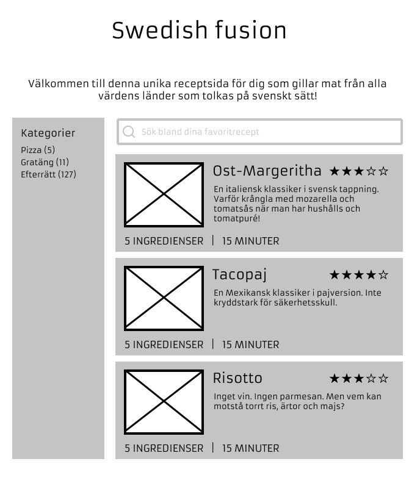
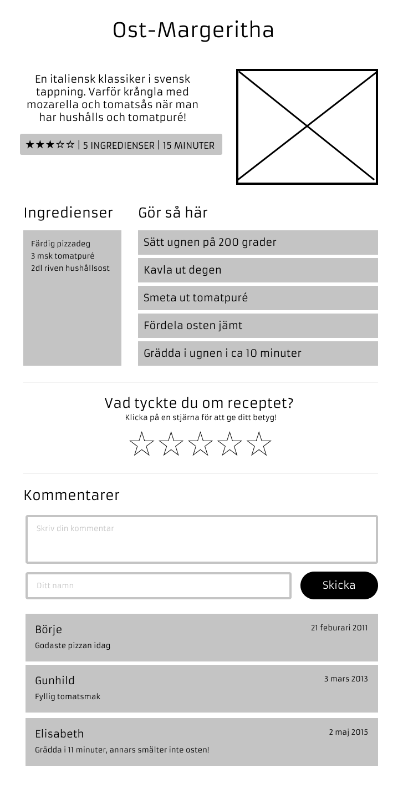

# Slutprojekt - Receptsajten

Er uppgift är att bygga en frontend för en receptsajt. Du får fritt välja tema för din sajt. Kanske är någon av *Finska desserter*, *Alkoholfria gindrinkar* eller *Souz vide-klassiker* exempel på en receptsida du alltid saknat? Eller något helt annat!

För att bygga receptsajten ska ni såklart använda **React**. Ett API är under utveckling av backend-teamet och det är där ni ska hämta recept ifrån.

Projektet ska lämnas in tisdag 14/6 kl 23.59 och presenteras för klassen onsdag 15/6.

---

Appen ska ha ett antal routes. Dessa ska implementeras med hjälp av React Router och är följande:

|Vy             |Frontend- route         |Innehåll |
|---------------|------------------------|---------|
|Startsida      |`/`                     |Här listas alla recept. Man kan söka och filtrera på kategori. |
|Kategorisida   |`/category/:categoryId` |Samma som *startsida* men listar endast recept i en viss kategori |
|Receptsida     |`/recipe/:recipeId`     |Här visas varje recept med ingredienser och instruktioner. |

**Startsida**

- Startsidan ska innehålla en lista med alla recept som ligger i databasen
- Varje recept som listas på startsidan ska visa upp relevant information om receptet, t.ex:
  - Namnet på receptet
  - Liten bild
  - Rating
  - Hur många ingredienser
  - Tid det tar att göra receptet
- Startsidan ska ha en lista som visar alla kategorier
  - Bredvid kategorinamnet ska det stå hur många recept som finns i den kategorin
  - Klickar man på kategorin ska man länkas till *Kategorisidan*
- Startsidan ska ha en sökruta
  - Om man skriver i sökrutan visas endast de recept som matchar sökningen

*Wireframe: Startsida*

**Kategorisida**

- Kategorisidan har samma design som startsidan men listar bara recept i vald kategori
- I kategorilistan ska vald kategori vara markerad med t.ex. fet text

**Receptsida**

- Receptsidan ska minst visa upp:
  - Receptets namn
  - Beskrivning av rätten
  - Rating
  - Antal ingredienser
  - Hur lång tid det tar att laga receptet
  - Bild på maträtten
- Receptsidan ska ha en lista över alla ingredienser
- Receptsidan ska ha en sektion som visar alla instruktioner (Gör så här)
- Receptsidan ska ha en komponent där besökaren kan rösta på receptet genom att klicka på en av fem stjärnor
  - När man klickar på en stjärna skickas rösten in direkt
  - Efter att rösten skickats in ska det stå "Tack för ditt betyg!" istället för stjärnorna

*Kommenteringsfunktion*

- Användaren ska kunna posta en kommentar genom att
  - Fylla i en kommentar
  - Fylla i sitt namn
  - Klicka på skicka
- Om inte alla fält fyllts i ska tydliga valideringsmeddelanden visas upp för användaren och ingenting skickas iväg
- Under tiden kommentaren skickas ska fälten vara disablade så att man inte kan skicka dubbelt av misstag
- När kommetaren har skickats ska formuläret ersättas med texten "Tack för din kommentar!"
- Kommentarer som andra postat sedan tidigare ska visas upp i en lista och för varje kommentar ska visas
  - Namn på den som kommenterat
  - Kommentaren
  - Datum när kommentaren skickades in

---

*Wireframe: Receptsida*

---

## Lycka till!